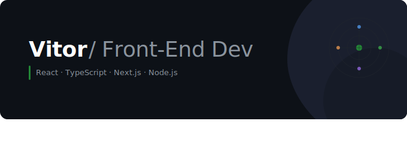

	

	
	
	
	

 

## Sobre Mim

👋 Sou desenvolvedor de software focado em desenvolvimento front-end, com experiência prática na construção de aplicações utilizando JavaScript, TypeScript e o ecossistema moderno de front-end e back-end. Tenho forte atenção à qualidade de código, organização de projetos e boas práticas como modularização, tipagem consistente e estrutura escalável.

 

## Tecnologias

### 💻 &nbsp;Linguagens

&nbsp;
&nbsp;
&nbsp;

### 🎨 &nbsp;Frontend

&nbsp;
&nbsp;
&nbsp;
&nbsp;
&nbsp;

### 🔧 &nbsp;Backend & Banco de Dados

&nbsp;
&nbsp;
&nbsp;
&nbsp;
&nbsp;

### ⚙️ &nbsp;Ferramentas & Workflow

&nbsp;
&nbsp;
&nbsp;
&nbsp;

 

## Estatísticas no GitHub

 

  

 

## Repositórios em Destaque
### Prism — Digest de Novidades Tech
> Agrega release notes de tecnologias populares e entrega digests de e-mail personalizados

- **O que faz**: Monitora React, TypeScript, Next.js, Vue e mais via GitHub Releases API
- **Stack**: Next.js, Node.js, TypeScript, Prisma, PostgreSQL, JWT Auth
- **Destaques**: Sistema de assinantes, digests personalizados, OAuth (Google & GitHub)
- [Ver Projeto →](https://github.com/VitorProgram/prism)

### Portfólio
> Portfólio pessoal com projetos, habilidades e trabalhos freelance

- **Stack**: Next.js, TypeScript, Tailwind CSS, Framer Motion
- **Destaques**: Design responsivo, animações fluidas, performance otimizada
- [Ver Projeto →](https://github.com/VitorProgram/portfolio)

